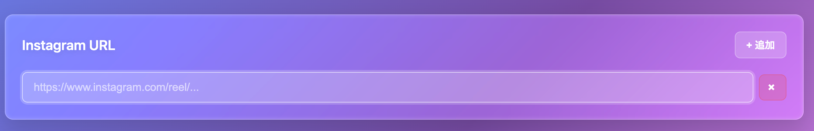
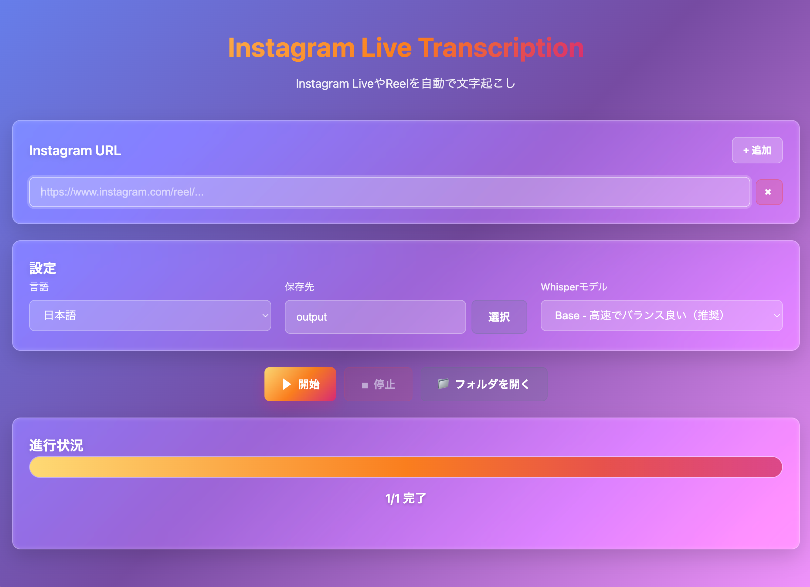

<div align="center">

<h1>
  
  Instagram Live Transcription
</h1>

<p align="center">
  <strong>Instagram LiveやReelを簡単にMP3保存 & AI文字起こし</strong>
</p>

<p align="center">
  <a href="https://github.com/waqprime/tool-instagram-live-transcription/releases/latest">
    
  </a>
  <a href="https://github.com/waqprime/tool-instagram-live-transcription/releases">
    
  </a>
  <a href="LICENSE">
    
  </a>
</p>

<p align="center">
  <a href="#-ダウンロード方法">📥 ダウンロード</a> •
  <a href="#-使い方簡単3ステップ">📖 使い方</a> •
  <a href="#-よくある質問faq">❓ FAQ</a> •
  <a href="#-トラブルシューティング">🔧 サポート</a>
</p>

<br>


<br>
<br>

</div>

<br>

## ✨ できること

<table>
<tr>
<td align="center" width="25%">
<br>
<b>動画→音声変換</b><br>
<sub>Instagram動画を高音質MP3として保存</sub>
</td>
<td align="center" width="25%">
<br>
<b>AI文字起こし</b><br>
<sub>OpenAI Whisperで自動テキスト化</sub>
</td>
<td align="center" width="25%">
<br>
<b>自動アップデート</b><br>
<sub>新バージョンを自動でお知らせ</sub>
</td>
<td align="center" width="25%">
<br>
<b>簡単操作</b><br>
<sub>URLを貼り付けるだけ！</sub>
</td>
</tr>
</table>

<br>

## 📥 ダウンロード方法

<div align="center">

### 💾 最新版をダウンロード

<a href="https://github.com/waqprime/tool-instagram-live-transcription/releases/latest">
  
</a>

<br><br>

</div>

| OS | ダウンロードファイル | サイズ | 動作環境 |
|:---:|:---|:---:|:---|
| 🍎 **macOS** | `Instagram Live Transcription-1.0.0-arm64.dmg` | ~90MB | macOS 10.15 (Catalina) 以降 |
| 🪟 **Windows** | `Instagram Live Transcription Setup 1.0.0.exe` | ~90MB | Windows 10 / 11 |

<br>

### ステップ 2: インストール

#### 🍎 macOS の場合

1. ダウンロードした `.dmg` ファイルをダブルクリック
2. 表示されたウィンドウで、アプリを「Applications」フォルダにドラッグ
3. Launchpad または Finder から「Instagram Live Transcription」を起動

**⚠️ 初回起動時に「開発元を確認できません」と表示される場合:**

<details>
<summary>👉 解決方法を見る</summary>

1. アプリを**右クリック**（または Control + クリック）
2. メニューから「**開く**」を選択
3. 確認ダイアログで「**開く**」をクリック

これで次回から通常通り起動できます。

</details>

---

#### 🪟 Windows の場合

1. ダウンロードした `.exe` ファイルをダブルクリック
2. インストーラーの指示に従ってインストール
3. デスクトップまたはスタートメニューから起動

**⚠️「WindowsによってPCが保護されました」と表示される場合:**

<details>
<summary>👉 解決方法を見る</summary>

1. 「**詳細情報**」をクリック
2. 「**実行**」ボタンをクリック

これは署名されていないアプリの標準的な警告です。安全なアプリですのでご安心ください。

</details>

<br>

## 🚀 使い方（簡単3ステップ）

<br>

<div align="center">

### 📹 ステップ 1: Instagram URLをコピー

Instagram アプリまたはブラウザで動画を開き、「**シェア**」→「**リンクをコピー**」

```
例: https://www.instagram.com/reel/ABC123xyz/
```

<br>

↓

<br>

### 🎬 ステップ 2: アプリに貼り付け


1. アプリを起動
2. **URLを入力**欄に、コピーしたリンクを貼り付け
3. **保存先フォルダ**を選択（デフォルトは `output`）
4. **言語**を選択（日本語 / 英語 / 自動検出）
5. **Whisperモデル**を選択（迷ったら「Base」でOK）

<br>

↓

<br>

### ⚡ ステップ 3: 処理開始！

「**処理開始**」ボタンをクリックするだけ！

<br>

```
📥 動画ダウンロード → 🎵 MP3抽出 → 📝 AI文字起こし → ✅ 完了！
```

<br>

| 動画の長さ | 処理時間の目安 |
|:---:|:---|
| 5分 | 約2〜3分 |
| 30分 | 約10〜15分 |
| 60分 | 約20〜30分 |

</div>

<br>

<details>
<summary>📸 処理中の画面を見る</summary>

<div align="center">
  
  <p><i>リアルタイムで進捗状況が表示されます</i></p>
</div>

</details>

<details>
<summary>✅ 完了画面を見る</summary>

<div align="center">
  
  <p><i>完了後すぐにフォルダを開いて確認できます</i></p>
</div>

</details>

<br>

## 🎯 Whisperモデルの選び方

<div align="center">
<sub>処理速度と精度のバランスで選べます</sub>
</div>

<br>

| モデル | 精度 | 速度 | おすすめの用途 |
|:---:|:---:|:---:|:---|
| **Tiny** | ⭐ | ⚡⚡⚡⚡⚡ | とにかく速く試したい |
| **Base** | ⭐⭐ | ⚡⚡⚡⚡ | **初心者におすすめ！** バランス型 |
| **Small** | ⭐⭐⭐ | ⚡⚡⚡ | 精度重視で、ある程度速くしたい |
| **Medium** | ⭐⭐⭐⭐ | ⚡⚡ | 高精度が必要（処理時間長め） |
| **Large** | ⭐⭐⭐⭐⭐ | ⚡ | 最高精度（要高性能PC） |

<div align="center">

💡 **迷ったら「Base」を選びましょう！**

</div>

<br>

## 📂 ファイルの保存場所

<div align="center">
<sub>選択した保存先フォルダに、自動的に整理されて保存されます</sub>
</div>

<br>

```
📁 output/
  ├── 📁 video_1_2025-01-15T10-30-45/
  │   ├── 🎵 video_1.mp3              ← 音声ファイル
  │   └── 📄 video_1_transcript.txt   ← 文字起こし結果
  │
  └── 📁 video_2_2025-01-15T10-45-20/
      ├── 🎵 video_2.mp3
      └── 📄 video_2_transcript.txt
```

<div align="center">

✅ **完了後に「フォルダを開く」ボタンで、すぐに確認できます！**

</div>

<br>

## ❓ よくある質問（FAQ）

<details>
<summary><b>Q1: アプリは無料ですか？</b></summary>

**A:** はい、完全無料です。個人利用・商用利用ともに自由にご利用いただけます。

</details>

<details>
<summary><b>Q2: Instagram以外の動画も処理できますか？</b></summary>

**A:** 現在はInstagramのみ対応していますが、将来的に他のプラットフォームにも対応予定です。

</details>

<details>
<summary><b>Q3: インターネット接続は必要ですか？</b></summary>

**A:** はい、以下の場合に必要です：
- 動画のダウンロード時
- 初回起動時（Whisperモデルのダウンロード）
- アップデートの確認時

処理自体（文字起こし）はオフラインで実行されます。

</details>

<details>
<summary><b>Q4: どのくらい時間がかかりますか？</b></summary>

**A:** 動画の長さとWhisperモデルによります：

| 動画の長さ | Base モデル | Large モデル |
|:---:|:---:|:---:|
| 5分 | 約2〜3分 | 約5〜8分 |
| 30分 | 約10〜15分 | 約30〜45分 |
| 60分 | 約20〜30分 | 約1〜1.5時間 |

</details>

<details>
<summary><b>Q5: 処理中に「モデルをダウンロード中」と表示されます</b></summary>

**A:** 初回起動時のみ、Whisperモデル（約200MB〜3GB）をダウンロードします。
次回からはダウンロード不要で、すぐに処理が始まります。

</details>

<details>
<summary><b>Q6: 複数の動画を一度に処理できますか？</b></summary>

**A:** はい！「URLを追加」ボタンで、複数のURLを入力できます。
順番に自動処理されます。

</details>

<details>
<summary><b>Q7: 文字起こしの精度を上げるには？</b></summary>

**A:** 以下の方法があります：
1. より大きなWhisperモデル（Small, Medium, Large）を選択
2. 音声がクリアな動画を選ぶ
3. 言語設定を正確に（日本語の場合は「Japanese」）

</details>

<details>
<summary><b>Q8: 自動アップデートを無効にできますか？</b></summary>

**A:** 現在は自動でチェックされますが、更新は任意です。
「今すぐインストール」をキャンセルすれば、現在のバージョンを使い続けられます。

</details>

<br>

## 🔧 トラブルシューティング

<div align="center">
<sub>よくある問題と解決方法</sub>
</div>

<br>

### ❌ 「ダウンロードに失敗しました」

**原因:**
- Instagram動画が非公開または削除されている
- ネットワーク接続の問題

**解決方法:**
1. URLが正しいか確認
2. 動画が公開されているか確認
3. インターネット接続を確認

<br>

### ❌ 「音声抽出に失敗しました」

**原因:** ffmpegがインストールされていない

**解決方法（macOS）:**
```bash
brew install ffmpeg
```

**解決方法（Windows）:**
1. [ffmpeg公式サイト](https://ffmpeg.org/download.html) からダウンロード
2. インストールしてPATHに追加

<br>

### ❌ 処理が途中で止まる

**考えられる原因:**
- PCのメモリ不足
- Whisperモデルが大きすぎる

**解決方法:**
1. 他のアプリを閉じてメモリを解放
2. より小さいモデル（Tiny, Base）を試す
3. アプリを再起動

<br>

### ❌ macOSで「開発元を確認できません」

**解決方法:**
1. アプリを**右クリック**
2. 「**開く**」を選択
3. 確認ダイアログで「**開く**」をクリック

<br>

### ❌ Windowsで「WindowsによってPCが保護されました」

**解決方法:**
1. 「**詳細情報**」をクリック
2. 「**実行**」をクリック

<br>

## 🔄 自動アップデート機能

<div align="center">

アプリは起動時に自動的に新しいバージョンをチェックします

</div>

<br>

```
🔍 起動時チェック → 📥 バックグラウンドDL → 🔔 通知 → ✅ 自動更新
```

<br>

## 🛡️ プライバシーとセキュリティ

<table>
<tr>
<td align="center" width="25%">
✅<br><b>ローカル処理</b><br><sub>すべてPC上で実行</sub>
</td>
<td align="center" width="25%">
✅<br><b>データ送信なし</b><br><sub>外部サーバー不使用</sub>
</td>
<td align="center" width="25%">
✅<br><b>個人情報収集なし</b><br><sub>完全プライベート</sub>
</td>
<td align="center" width="25%">
✅<br><b>オープンソース</b><br><sub>コード完全公開</sub>
</td>
</tr>
</table>

<br>

## 📄 ライセンス

<div align="center">

MIT License - 個人利用・商用利用ともに自由にご利用いただけます

</div>

<br>

## 🤝 フィードバック・バグ報告

<div align="center">

問題や要望があれば、お気軽に[Issue](https://github.com/waqprime/tool-instagram-live-transcription/issues)を作成してください！

<br><br>

<a href="https://github.com/waqprime/tool-instagram-live-transcription/issues/new">
  
</a>
&nbsp;&nbsp;
<a href="https://github.com/waqprime/tool-instagram-live-transcription/issues/new">
  
</a>

</div>

<br>

## 🏗️ 技術スタック

<details>
<summary>開発者向け情報</summary>

### フロントエンド
- Electron
- HTML/CSS/JavaScript（Liquid Glass UI）
- electron-updater

### バックエンド
- Python 3.13
- yt-dlp
- ffmpeg
- OpenAI Whisper

### ビルド & デプロイ
- electron-builder
- GitHub Actions（自動ビルド）
- GitHub Releases（配布）

### 開発モードで起動
```bash
cd electron-app
npm install
npm start
```

詳しくは [CLAUDE.md](CLAUDE.md) と `electron-app/RELEASE_GUIDE.md` を参照。

</details>

<br>

## 🙏 謝辞

<div align="center">

このプロジェクトは以下のオープンソースプロジェクトを使用しています

<br><br>

<table>
<tr>
<td align="center">
<a href="https://github.com/yt-dlp/yt-dlp">

</a><br>
<sub>Instagram動画ダウンロード</sub>
</td>
<td align="center">
<a href="https://github.com/openai/whisper">

</a><br>
<sub>音声認識エンジン</sub>
</td>
<td align="center">
<a href="https://www.electronjs.org/">

</a><br>
<sub>クロスプラットフォーム</sub>
</td>
<td align="center">
<a href="https://ffmpeg.org/">

</a><br>
<sub>音声処理</sub>
</td>
</tr>
</table>

</div>

<br>

---

<div align="center">

<h3>⭐ このプロジェクトが役に立ったら、ぜひスターをお願いします！ ⭐</h3>

<br>

<a href="https://github.com/waqprime/tool-instagram-live-transcription">
  
</a>

<br><br>

Made with ❤️ by [waqprime](https://github.com/waqprime)

<br><br>

[](https://github.com/waqprime)

</div>
