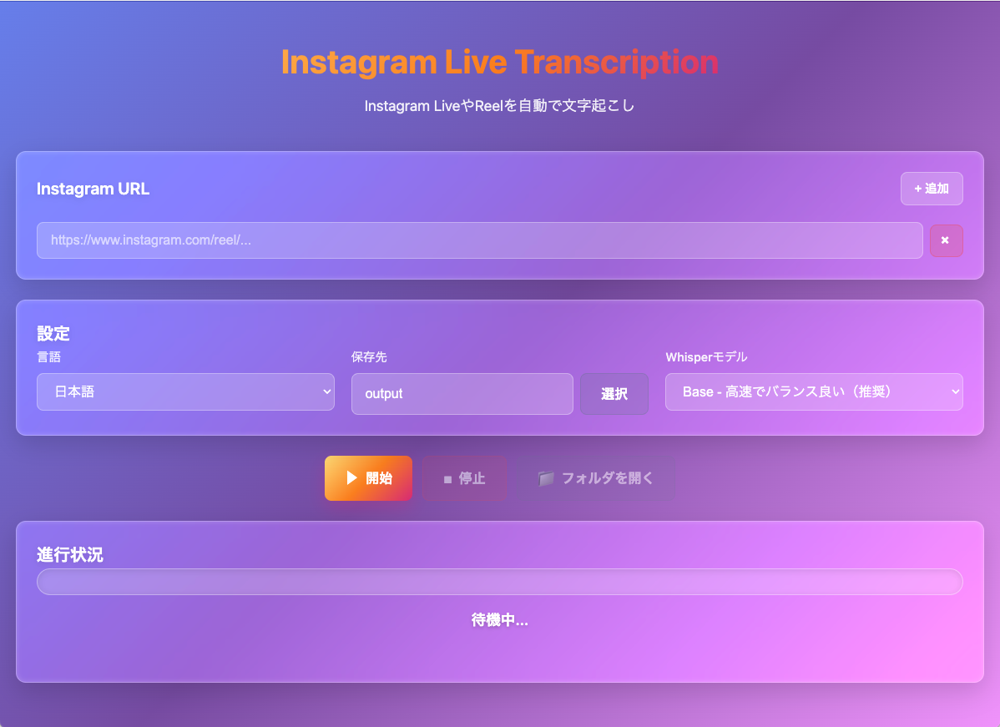
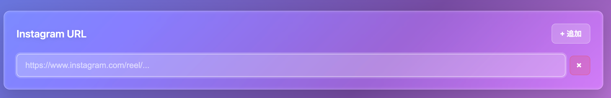
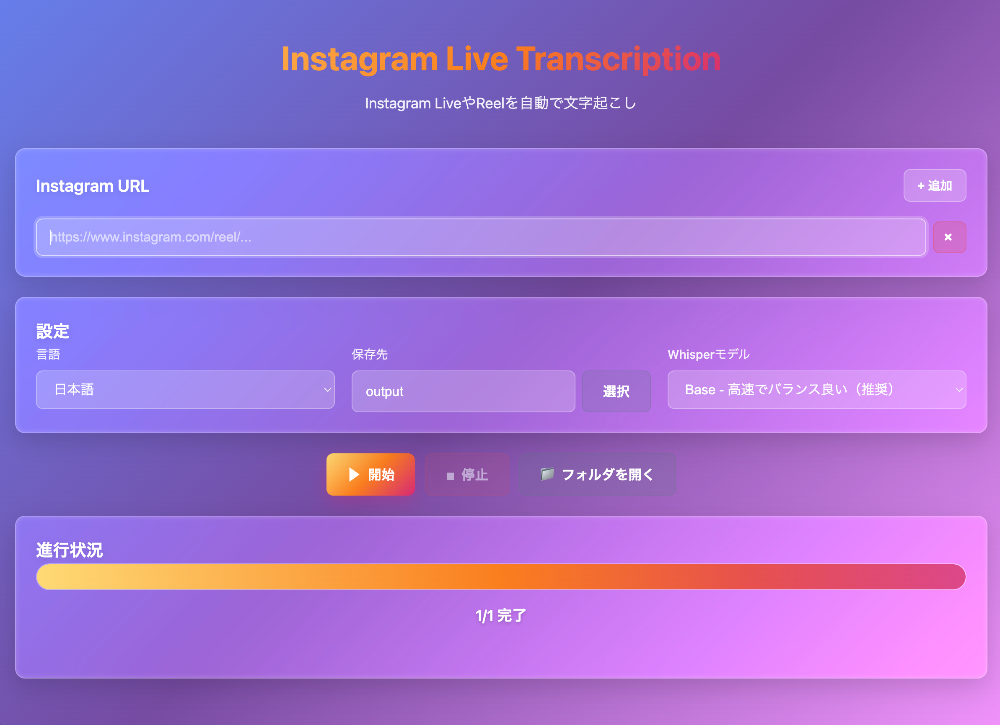

<div align="center">

<!-- Header with gradient background effect -->
<picture>
  <source media="(prefers-color-scheme: dark)" srcset="https://user-images.githubusercontent.com/your-banner-dark.png">
  
</picture>

<br>

<h3>🎙️ 多様なプラットフォームの動画・音声を簡単にMP3保存 & AI文字起こし ✨</h3>
<p align="center">
  <strong>対応:</strong> Instagram • YouTube • X Spaces • Voicy • Radiko • stand.fm 等
</p>

<p>
  <a href="https://github.com/waqprime/tool-instagram-live-transcription/releases/latest">
    
  </a>
  <a href="https://github.com/waqprime/tool-instagram-live-transcription/releases">
    
  </a>
  <a href="LICENSE">
    
  </a>
</p>

<p>
  <a href="#-ダウンロード">📥 ダウンロード</a> •
  <a href="#-使い方">📖 使い方</a> •
  <a href="#-faq">❓ FAQ</a> •
  <a href="#-サポート">🛟 サポート</a>
</p>

</div>

<br>

<!-- App Screenshot with shadow -->
<div align="center">
  
</div>

<br>

<br>

## ✨ できること

<table>
<tr>
<td align="center" width="20%">
<br>
<b>動画→音声変換</b><br>
<sub>各種プラットフォームの動画を高音質MP3として保存</sub>
</td>
<td align="center" width="20%">
<br>
<b>AI文字起こし</b><br>
<sub>faster-whisper / kotoba-whisper / OpenAI APIで自動テキスト化</sub>
</td>
<td align="center" width="20%">
<br>
<b>AI要約</b><br>
<sub>APIキー不要のビルトイン要約機能</sub>
</td>
<td align="center" width="20%">
<br>
<b>自動アップデート</b><br>
<sub>新バージョンを自動でお知らせ</sub>
</td>
<td align="center" width="20%">
<br>
<b>簡単操作</b><br>
<sub>URLを貼り付けるだけ！</sub>
</td>
</tr>
</table>

<br>

<!-- Download Section -->
<div align="center">

## 📥 ダウンロード

<br>

<a href="https://github.com/waqprime/tool-instagram-live-transcription/releases/latest">
  
</a>

<br><br>

</div>

<table>
<thead>
<tr>
<th align="center" width="10%">OS</th>
<th align="center" width="50%">ダウンロードファイル</th>
<th align="center" width="15%">サイズ</th>
<th align="center" width="25%">動作環境</th>
</tr>
</thead>
<tbody>
<tr>
<td align="center">🍎<br><strong>macOS</strong><br>(Apple Silicon)</td>
<td align="center"><code>TranscriptionTool-X.Y.Z-arm64.dmg</code></td>
<td align="center">~196MB</td>
<td align="center">macOS 10.15 以降<br>(M1/M2/M3/M4)</td>
</tr>
<tr>
<td align="center">🍎<br><strong>macOS</strong><br>(Intel)</td>
<td align="center"><code>TranscriptionTool-X.Y.Z-x64.dmg</code></td>
<td align="center">~223MB</td>
<td align="center">macOS 10.15 以降<br>(Intel Mac)</td>
</tr>
<tr>
<td align="center">🪟<br><strong>Windows</strong><br>(インストーラー)</td>
<td align="center"><code>TranscriptionTool-X.Y.Z-Setup.exe</code></td>
<td align="center">~207MB</td>
<td align="center">Windows 10 / 11</td>
</tr>
<tr>
<td align="center">🪟<br><strong>Windows</strong><br>(ポータブル)</td>
<td align="center"><code>TranscriptionTool-X.Y.Z-portable.exe</code></td>
<td align="center">~207MB</td>
<td align="center">Windows 10 / 11<br>(インストール不要)</td>
</tr>
</tbody>
</table>

<br>

<div align="center">

<h3>💿 インストール方法</h3>

</div>

<table>
<tr>
<td width="50%" valign="top">

<h4>🍎 macOS の場合</h4>

1. ダウンロードした `.dmg` ファイルをダブルクリック
2. 表示されたウィンドウで、アプリを「Applications」フォルダにドラッグ
3. Launchpad または Finder から「Instagram Live Transcription」を起動

<br>

<details>
<summary><strong>⚠️ 「開発元を確認できません」と表示される場合</strong></summary>

<br>

1. アプリを**右クリック**（または Control + クリック）
2. メニューから「**開く**」を選択
3. 確認ダイアログで「**開く**」をクリック

これで次回から通常通り起動できます。

</details>

</td>
<td width="50%" valign="top">

<h4>🪟 Windows の場合</h4>

1. ダウンロードした `.exe` ファイルをダブルクリック
2. インストーラーの指示に従ってインストール
3. デスクトップまたはスタートメニューから起動

<br>

<details>
<summary><strong>⚠️ 「WindowsによってPCが保護されました」と表示される場合</strong></summary>

<br>

1. 「**詳細情報**」をクリック
2. 「**実行**」ボタンをクリック

これは署名されていないアプリの標準的な警告です。安全なアプリですのでご安心ください。

</details>

</td>
</tr>
</table>

<br>

<br>

<!-- Usage Section -->
<div align="center">

## 🚀 使い方

<sub>たった3ステップで完了！</sub>

</div>

<br>

<table>
<tr>
<td align="center" width="33%">

<h3>ステップ 1</h3>
<h4>📹 URLをコピー</h4>
<p>各プラットフォームで動画・音声を開き、<br>「<strong>シェア</strong>」→「<strong>リンクをコピー</strong>」</p>
<sub>Instagram, YouTube, X Spaces, Voicy等</sub>
</td>
<td align="center" width="33%">

<h3>ステップ 2</h3>
<h4>🎬 アプリに貼り付け</h4>
<p>
1️⃣ アプリを起動<br>
2️⃣ URLを入力欄に貼り付け<br>
3️⃣ 保存先フォルダを選択<br>
4️⃣ 言語を選択<br>
5️⃣ Whisperモデルを選択
</p>
</td>
<td align="center" width="33%">

<h3>ステップ 3</h3>
<h4>⚡ 処理開始！</h4>
<p>「<strong>処理開始</strong>」ボタンを<br>クリックするだけ！</p>
<br>
<sub>📥 ダウンロード → 🎵 MP3抽出 → 📝 文字起こし → ✅ 完了</sub>
</td>
</tr>
</table>

<br>

<div align="center">

<h3>📱 アプリ画面</h3>


</div>

<br>

<div align="center">

<h3>⏱️ 処理時間の目安</h3>

</div>

<table>
<thead>
<tr>
<th align="center" width="25%">🎬 動画の長さ</th>
<th align="center" width="25%">⚡ Base モデル</th>
<th align="center" width="25%">🚀 Medium モデル</th>
<th align="center" width="25%">💎 Large モデル</th>
</tr>
</thead>
<tbody>
<tr>
<td align="center"><strong>5分</strong></td>
<td align="center">約2〜3分</td>
<td align="center">約3〜5分</td>
<td align="center">約5〜8分</td>
</tr>
<tr>
<td align="center"><strong>30分</strong></td>
<td align="center">約10〜15分</td>
<td align="center">約15〜25分</td>
<td align="center">約30〜45分</td>
</tr>
<tr>
<td align="center"><strong>60分</strong></td>
<td align="center">約20〜30分</td>
<td align="center">約40〜60分</td>
<td align="center">約1〜1.5時間</td>
</tr>
</tbody>
</table>

<br>

<details>
<summary>📸 処理中の画面を見る</summary>

<div align="center">
  
  <p><i>リアルタイムで進捗状況が表示されます</i></p>
</div>

</details>

<details>
<summary>✅ 完了画面を見る</summary>

<div align="center">
  
  <p><i>完了後すぐにフォルダを開いて確認できます</i></p>
</div>

</details>

<br>

<br>

<!-- Model Selection Section -->
<div align="center">

## 🎯 文字起こしエンジン & モデル選択

<sub>用途に合わせてエンジンとモデルを選べます</sub>

</div>

<br>

### 文字起こしエンジン

| エンジン | 特徴 | APIキー |
|:---:|:---|:---:|
| **faster-whisper** 👈 推奨 | 高速・高精度。ローカル実行 | 不要 |
| **kotoba-whisper** | 日本語特化。Whisper large-v3より高精度・6.3倍高速 | 不要 |
| **OpenAI API** | クラウド実行。PCスペック不要 | 必要 |

### faster-whisper モデル

| モデル | 📊 精度 | ⚡ 速度 | 💡 おすすめの用途 |
|:---:|:---:|:---:|:---|
| **large-v3-turbo** 👈 推奨 | ⭐⭐⭐⭐⭐ | ⚡⚡⚡⚡ | **高速かつ高精度（デフォルト）** |
| **large-v3** | ⭐⭐⭐⭐⭐ | ⚡⚡ | 最高精度 |
| **medium** | ⭐⭐⭐⭐ | ⚡⚡⚡ | バランス型 |
| **small** | ⭐⭐⭐ | ⚡⚡⚡⚡ | 軽量・高速 |
| **tiny** | ⭐⭐ | ⚡⚡⚡⚡⚡ | とにかく速く試したい |

### 内容要約機能

文字起こし後のテキストをAIで自動要約できます。

| プロバイダ | モデル | APIキー | 備考 |
|:---:|:---:|:---:|:---|
| **ビルトイン** 👈 推奨 | gemini-2.5-flash-lite | **不要** | そのまま使える！ |
| **Gemini API** | gemini-2.5-flash 等 | 必要 | 高精度モデルを選択可能 |
| **OpenAI API** | gpt-4o-mini 等 | 必要 | OpenAI派向け |

<div align="center">

<br>

💡 **迷ったら faster-whisper の large-v3-turbo + ビルトイン要約でOK！**

</div>

<br>

## 📂 ファイルの保存場所

<div align="center">
<sub>選択した保存先フォルダに、自動的に整理されて保存されます</sub>
</div>

<br>

```
📁 output/
  ├── 📁 video_1_2025-01-15T10-30-45/
  │   ├── 🎵 video_1.mp3              ← 音声ファイル
  │   └── 📄 video_1_transcript.txt   ← 文字起こし結果
  │
  └── 📁 video_2_2025-01-15T10-45-20/
      ├── 🎵 video_2.mp3
      └── 📄 video_2_transcript.txt
```

<div align="center">

✅ **完了後に「フォルダを開く」ボタンで、すぐに確認できます！**

</div>

<br>

<br>

<!-- FAQ Section -->
<div align="center">

## ❓ FAQ

<sub>よくある質問と回答</sub>

</div>

<br>

<details>
<summary><b>Q1: アプリは無料ですか？</b></summary>

**A:** はい、完全無料です。個人利用・商用利用ともに自由にご利用いただけます。

</details>

<details>
<summary><b>Q2: どのプラットフォームに対応していますか？</b></summary>

**A:** yt-dlpが対応する1,800以上のサイトに対応しています！

主な対応プラットフォーム:
- **Instagram** - Live, Reels, 投稿動画
- **YouTube** - 動画, ライブ配信, Podcast
- **X (Twitter)** - Spaces（音声ライブ）
- **Voicy** - 音声配信（独自実装で完全対応）
- **stand.fm** - 音声配信（独自実装で完全対応）
- **Radiko** - ラジオ配信
- **ニコニコ動画** - 動画, ライブ
- **TVer** - テレビ番組
- **AbemaTV** - 動画配信
- **TikTok** - 動画
- **Twitch** - ライブ配信, アーカイブ
- **SoundCloud** - 音声配信
- **Facebook** - 動画
- **Apple Podcasts** - ポッドキャスト
- その他yt-dlp対応の1,800以上のサイト

URLを貼り付けるだけで自動判定されます！

</details>

<details>
<summary><b>Q3: インターネット接続は必要ですか？</b></summary>

**A:** はい、以下の場合に必要です：
- 動画のダウンロード時
- 初回起動時（Whisperモデルのダウンロード）
- アップデートの確認時

処理自体（文字起こし）はオフラインで実行されます。

</details>

<details>
<summary><b>Q4: どのくらい時間がかかりますか？</b></summary>

**A:** 動画の長さとWhisperモデルによります：

| 動画の長さ | Base モデル | Large モデル |
|:---:|:---:|:---:|
| 5分 | 約2〜3分 | 約5〜8分 |
| 30分 | 約10〜15分 | 約30〜45分 |
| 60分 | 約20〜30分 | 約1〜1.5時間 |

</details>

<details>
<summary><b>Q5: 処理中に「モデルをダウンロード中」と表示されます</b></summary>

**A:** 初回起動時のみ、Whisperモデル（約200MB〜3GB）をダウンロードします。
次回からはダウンロード不要で、すぐに処理が始まります。

</details>

<details>
<summary><b>Q6: 複数の動画を一度に処理できますか？</b></summary>

**A:** はい！「URLを追加」ボタンで、複数のURLを入力できます。
順番に自動処理されます。

</details>

<details>
<summary><b>Q7: 文字起こしの精度を上げるには？</b></summary>

**A:** 以下の方法があります：
1. より大きなWhisperモデル（Small, Medium, Large）を選択
2. 音声がクリアな動画を選ぶ
3. 言語設定を正確に（日本語の場合は「Japanese」）

</details>

<details>
<summary><b>Q8: 自動アップデートを無効にできますか？</b></summary>

**A:** 現在は自動でチェックされますが、更新は任意です。
「今すぐインストール」をキャンセルすれば、現在のバージョンを使い続けられます。

</details>

<br>

<br>

<!-- Troubleshooting Section -->
<div align="center">

## 🛟 サポート

<sub>よくある問題と解決方法</sub>

</div>

<br>

### ❌ 「ダウンロードに失敗しました」

**原因:**
- Instagram動画が非公開または削除されている
- ネットワーク接続の問題

**解決方法:**
1. URLが正しいか確認
2. 動画が公開されているか確認
3. インターネット接続を確認

<br>

### ❌ 「音声抽出に失敗しました」

**原因:** ffmpegがインストールされていない

**解決方法（macOS）:**
```bash
brew install ffmpeg
```

**解決方法（Windows）:**
1. [ffmpeg公式サイト](https://ffmpeg.org/download.html) からダウンロード
2. インストールしてPATHに追加

<br>

### ❌ 処理が途中で止まる

**考えられる原因:**
- PCのメモリ不足
- Whisperモデルが大きすぎる

**解決方法:**
1. 他のアプリを閉じてメモリを解放
2. より小さいモデル（Tiny, Base）を試す
3. アプリを再起動

<br>

### ❌ macOSで「開発元を確認できません」

**解決方法:**
1. アプリを**右クリック**
2. 「**開く**」を選択
3. 確認ダイアログで「**開く**」をクリック

<br>

### ❌ Windowsで「WindowsによってPCが保護されました」

**解決方法:**
1. 「**詳細情報**」をクリック
2. 「**実行**」をクリック

<br>

## 🔄 自動アップデート機能

<div align="center">

アプリは起動時に自動的に新しいバージョンをチェックします

</div>

<br>

```
🔍 起動時チェック → 📥 バックグラウンドDL → 🔔 通知 → ✅ 自動更新
```

<br>

## 🛡️ プライバシーとセキュリティ

<table>
<tr>
<td align="center" width="25%">
✅<br><b>ローカル処理</b><br><sub>文字起こしはPC上で実行</sub>
</td>
<td align="center" width="25%">
✅<br><b>最小限の通信</b><br><sub>要約機能利用時のみテキストを送信</sub>
</td>
<td align="center" width="25%">
✅<br><b>個人情報収集なし</b><br><sub>完全プライベート</sub>
</td>
<td align="center" width="25%">
✅<br><b>オープンソース</b><br><sub>コード完全公開</sub>
</td>
</tr>
</table>

<br>

## 📄 ライセンス

<div align="center">

MIT License - 個人利用・商用利用ともに自由にご利用いただけます

</div>

<br>

## 🤝 フィードバック・バグ報告

<div align="center">

問題や要望があれば、お気軽に[Issue](https://github.com/waqprime/tool-instagram-live-transcription/issues)を作成してください！

<br><br>

<a href="https://github.com/waqprime/tool-instagram-live-transcription/issues/new">
  
</a>
&nbsp;&nbsp;
<a href="https://github.com/waqprime/tool-instagram-live-transcription/issues/new">
  
</a>

</div>

<br>

## 🏗️ 技術スタック

<details>
<summary>開発者向け情報</summary>

### フロントエンド
- Electron 28
- HTML/CSS/JavaScript（Liquid Glass UI）
- electron-updater（自動アップデート通知）

### バックエンド
- Python 3.11+
- faster-whisper（デフォルト文字起こしエンジン）
- kotoba-whisper v2.0（日本語特化エンジン、オプション）
- yt-dlp（動画・音声ダウンロード）
- ffmpeg（音声変換）
- Selenium（Voicy/UTAGE対応）

### 要約機能
- ビルトイン: AWS Lambda + Gemini 2.5 Flash Lite（APIキー不要）
- オプション: Gemini API / OpenAI API（ユーザーのAPIキー使用）

### ビルド & デプロイ
- electron-builder + PyInstaller
- GitHub Actions（Windows + macOS arm64 自動ビルド・署名・公証）
- macOS x64（Intel Mac）はローカル手動ビルド
- GitHub Releases（配布）

### 開発モードで起動
```bash
cd electron-app
npm install
npm start
```

詳しくは [CLAUDE.md](CLAUDE.md) と `electron-app/RELEASE_GUIDE.md` を参照。

</details>

<br>

## 🙏 謝辞

<div align="center">

このプロジェクトは以下のオープンソースプロジェクトを使用しています

<br><br>

<table>
<tr>
<td align="center">
<a href="https://github.com/yt-dlp/yt-dlp">

</a><br>
<sub>動画・音声ダウンロード</sub>
</td>
<td align="center">
<a href="https://github.com/SYSTRAN/faster-whisper">

</a><br>
<sub>高速音声認識エンジン</sub>
</td>
<td align="center">
<a href="https://huggingface.co/kotoba-tech/kotoba-whisper-v2.0">

</a><br>
<sub>日本語特化音声認識</sub>
</td>
</tr>
<tr>
<td align="center">
<a href="https://www.electronjs.org/">

</a><br>
<sub>クロスプラットフォーム</sub>
</td>
<td align="center">
<a href="https://ffmpeg.org/">

</a><br>
<sub>音声処理</sub>
</td>
<td align="center">
<a href="https://ai.google.dev/">

</a><br>
<sub>AI要約エンジン</sub>
</td>
</tr>
</table>

</div>

<br>

<br><br>

<!-- Footer -->
<div align="center">

<picture>
  <source media="(prefers-color-scheme: dark)" srcset="https://user-images.githubusercontent.com/your-footer-dark.png">
  
</picture>

<br>

<h3>⭐ このプロジェクトが役に立ったら、スターをお願いします！</h3>

<a href="https://github.com/waqprime/tool-instagram-live-transcription">
  
</a>

<br><br>

<sub>Made with ❤️ by <a href="https://github.com/waqprime">waqprime</a></sub>

<br>

<a href="https://github.com/waqprime">
  
</a>

</div>
